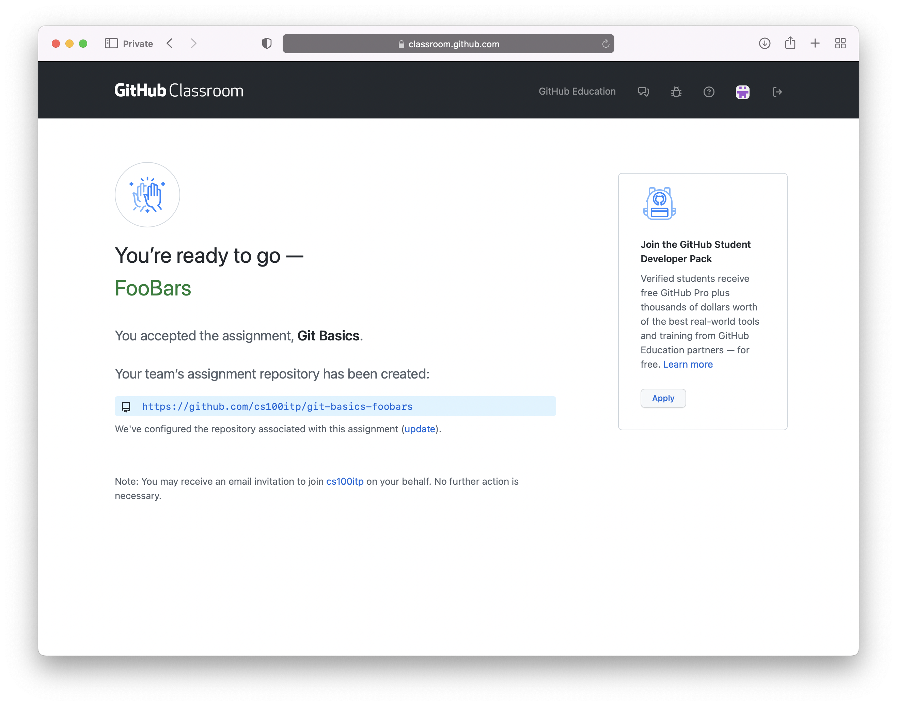
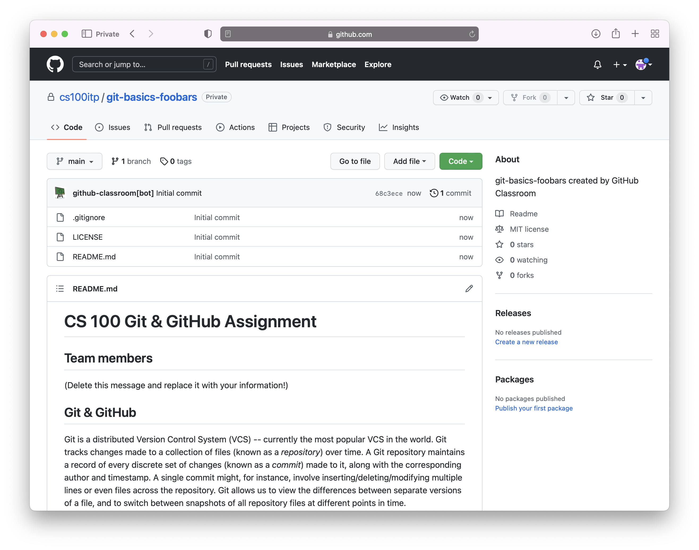
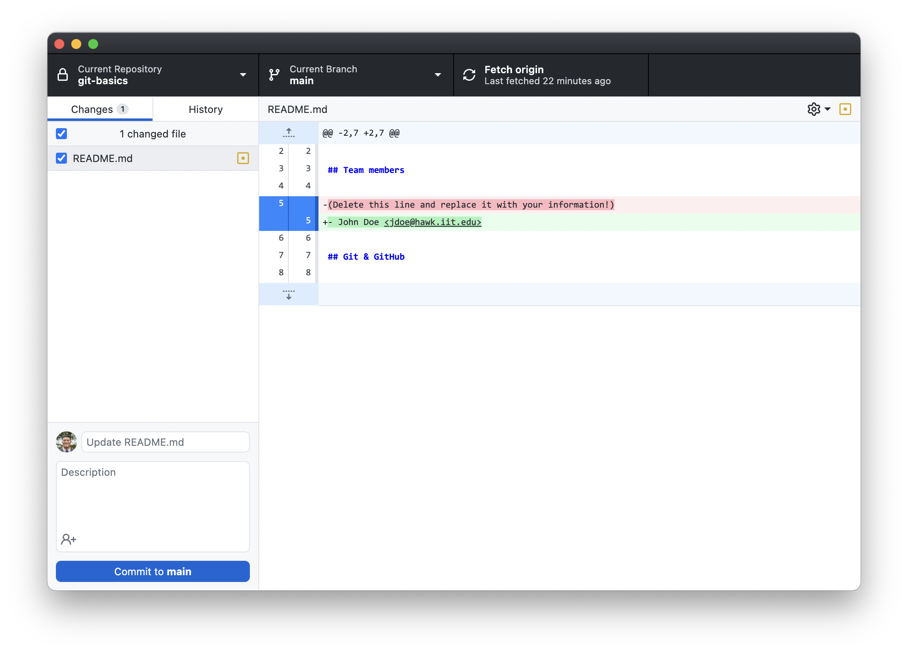
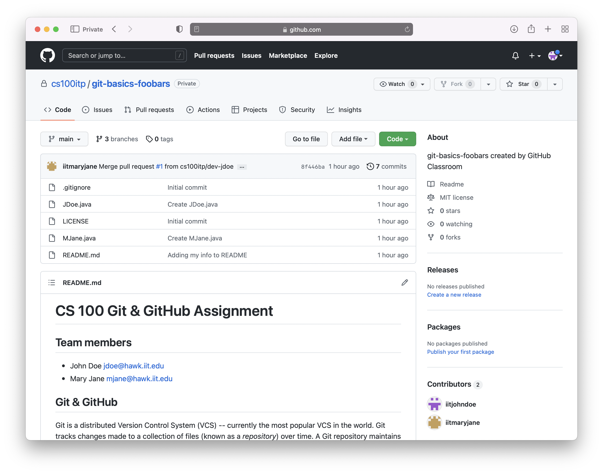
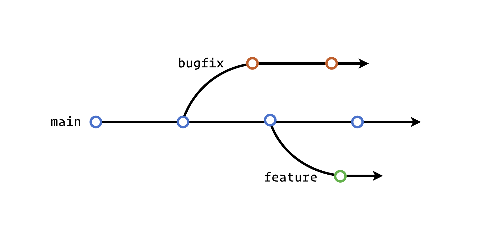
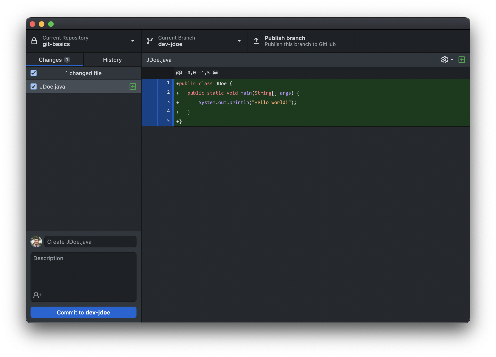
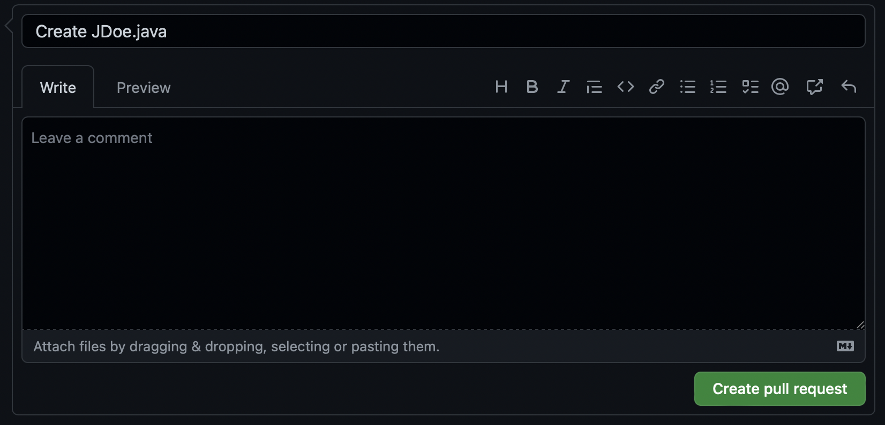
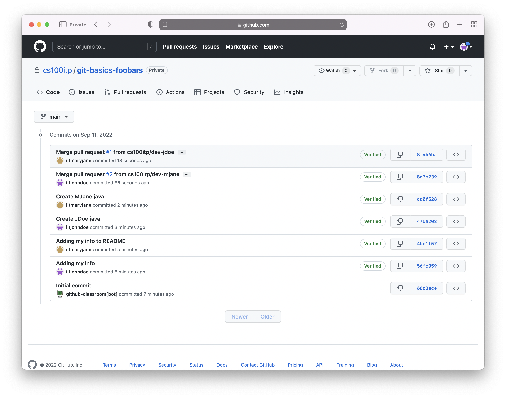

# CS 100 Git & GitHub Assignment

## Team members

-CGewont : Christopher Gewont cgewont@hawk.iit.edu

## Git & GitHub

Git is a distributed Version Control System (VCS) -- currently the most popular
VCS in the world. Git tracks changes made to a collection of files (known as a
*repository*) over time. A Git repository maintains a record of every discrete
set of changes (known as a *commit*) made to it, along with the corresponding
author and timestamp. A single commit might, for instance, involve
inserting/deleting/modifying multiple lines or even files across the repository.
Git allows us to view the differences between separate versions of a file, and
to switch between snapshots of all repository files at different points in time.

GitHub is a platform that allows us to store and manage Git repositories in the
cloud. The distributed nature of Git means that a repository can be easily
*cloned* -- i.e., we can copy the full record of all files and their changes to
a different machine. Developers working on separate clones of a single
repository may want to eventually synchronize or otherwise consolidate their
changes, using various features of Git and GitHub.

## Assignment Overview

For this assignment, we will have you work through a Git-based process of which
you'll likely encounter many variations in future classes and real-world
projects. To make things a bit more interesting, you will work in teams of 2-3
students.

Here's an overview of what each team will do:

1. Every team member will create an account on GitHub.

2. One team member will create a new team and accept the group assignment.

3. Remaining members will accept the group assignment and join the same team.

4. Each team member will *clone* the repository to their own computer.
   
5. One team member will edit a file in the repository, then *commit* and *push*
   their changes to GitHub.

6. Every other team member, in turn, will need to *pull* the changes from
   GitHub, then *commit* and *push* their own changes.

7. Each team member will publish a new *branch* and create a *pull request*.

8. Each team member will *merge* in a pull request (created by a different
   person).

## Details

In this section we'll go over each of the steps outlined in the overview above.
If you're confused about any of the steps, be sure to check in with a TA!

### Step 1

Every student will need to [create a personal account on
GitHub](https://github.com/signup). There are no restrictions on your username,
but as you may use this account throughout your career, keep it professional! If
you already have a GitHub account, you may use that.

### Step 2

After forming a team of 2-3 students, designate one team member to accept the
assignment using this link: <https://classroom.github.com/a/MFnr-oLv>. 

After selecting their username from the list, use the "Create a new team" option
--- feel free to come up with a fun team name, but keep it PG-13. After creating
a team and accepting the assignment, the subsequent page can be refreshed after
a few seconds to reach a confirmation page like this one (for team "FooBars"):

Clicking on the highlighted link will load the repository homepage, which should
look like this:

Note that this assignment writeup can also be viewed on the repository homepage.

### Step 3

At this point, only the founding team member will have access to the repository.
Each team member should visit <https://classroom.github.com/a/MFnr-oLv> to
accept the assignment, this time joining the same team created in the previous
step. 

When this is done, all team members will have access to the same repository
hosted on GitHub, which is also shared with the course instructors and TAs. Note
that each team member must be signed in separately -- this will ensure that
their updates to the repository will be correctly credited.

### Step 4

Now each team member needs to clone the repository onto their own computer so
they can work on it!

The easiest way to do this is by clicking on the green "Code" button on the
repository homepage, then clicking on the "Open with GitHub Desktop" link. If
you don't already have the application installed, this will prompt you to
download and install it. Do so, then start the application and sign into your
GitHub account. Try the link again, and this should open the application and
prompt you for a location to clone your repository to on your computer.

After you've finished cloning your repository, you should be able to view its
contents by clicking on the "Show in Finder/Explorer" button. At this point, you
should see the files "README.md", "LICENSE", and a folder named "images"
containing some PNGs. Don't touch anything just yet.

All team members should complete this step before anyone moves on.

---

Students already familiar with the command line interface (or up for a
challenge) may clone the repository that way. An alternative [Git
GUI](https://git-scm.com/downloads/guis) is also an option. If you're not
interested in experimenting at this point, though, stick with the GitHub Desktop
application! 

### Step 5

Over this step and the next, each team member will independently edit the
"README.md" file to add their own personal information. Critically, we will make
use of Git and GitHub to help track and disseminate these edits.

We'll go over a better way to coordinate changes in a later step, but for now
you'll do it manually. **Pick one member of your team to go first**, and have
just that person edit the "README.md" file: delete the line near the top of the
file just under "## Team members", and replace it with that member's name and
email address. It should look like this:

>     # CS 100 Git & GitHub Assignment
>     
>     ## Team members
>     
>     - John Doe <jdoe@hawk.iit.edu>
>     
>     ## Git & GitHub
>     
>     ...

After saving the changes, return to GitHub Application and you should find that
it has updated itself to look like this:

The red and green highlighted text indicate the change made to the "README.md"
file --- we call this a *diff* report.

Next you'll want to *commit* this change to your local repository. In the bottom
left area of the window replace the "Update README.md" text with your own *commit
message* --- something like "Adding my information to README.md" will do. Then
click the "Commit to main" button. When done, you can click on the "History" tab
to see a log of your recent commit.

Finally, you need to *push* the commit we just made to the repository on GitHub
(known as the "remote origin" repository). To do this, click on the button in
the top row of the window labeled "Push origin". After this completes, the
button should revert to saying "Fetch origin", and you're done with this step!

### Step 6

Before continuing, any team member should now be able to visit the repository
homepage in a browser, and click on the "README.md" file to verify that its
contents have been updated by the commit pushed in the previous step.

In this step, each remaining team member will, in turn, fetch the commits pushed
by previous team members, commit their own edits, and push them back to GitHub.

In the GitHub Desktop application, start by clicking on the "Fetch origin"
button. You should find that this updates your local repository with the
commit(s) previously pushed by other team members.

Next, follow the relevant instructions from the previous step to edit
"README.md", commit, and push changes to GitHub.

At the end of this step, all team members should click "Fetch origin" again to
synchronize their local repositories with GitHub. 

Congratulations -- you've all contributed successfully to a team project using
Git! Visiting the repository homepage on GitHub should display something like
the following (note the contributor list on the bottom right side):

### Step 7

An improvement to the collaboration model we walked you through in the previous
two steps relies on *branches* and *pull requests*.

A branch keeps track of a sequence of commits to our project. Thus far, all
commits have been made to the mainline branch (aka "trunk") --- the default name
of this branch is, simply, "main". 

At any point, however, we can create a new branch that splits off from the
mainline (or some other branch). Working in a secondary branch allows a
developer to commit changes that aren't immediately incorporated into the
*mainline*. Secondary branches might be created to work on fixing bugs, for
instance, or implementing new features. While work is committed to these
branches, the mainline branch may continue to advance. E.g., consider the
following repository consisting of three branches (each circle represents a
commit):

A developer working on a secondary branch may eventually want to *merge* their
changes (e.g., after completing a bugfix or feature) into the mainline. Such a
merge will take all the commits made to the secondary branch and add them to the
mainline. This is likely a significant decision requiring the input of other
developers and/or the project administrators. To facilitate this process, GitHub
allows *pull requests* to be submitted and approved.

We'll walk you through creating a branch and submitting a pull request, next.

---

To begin, each team member will create a new branch in their local repository.
Do this by clicking on the "Current branch" button atop the GitHub Desktop
application, then clicking "New branch". Each member should create a branch
named "dev-USERNAME", replacing USERNAME with their own Hawk ID (e.g.,
"dev-jdoe"). After doing this, confirm that the current branch is the newly
created one. 

Next, each person will add a new Java source file to their local repository.
Name the file "Username.java" (replacing "Username" with their own Hawk ID) --
its contents don't matter, but it shouldn't be empty (a "hello world" program is
fine). Commit this new file to the repository. This next screenshot is of the
interface just prior to finalizing the commit:

Next, click "Publish branch" to push your new branch to GitHub. When this
completes, click the "Create Pull Request" button to submit a pull request for
the new branch --- this will take you to the GitHub website to confirm the
action:

Click "Create pull request" again to finish submitting the pull request.

### Step 8

In this last step, each team member will act as the project maintainer and
merge in the branch associated with an outstanding pull request.

To do this, each person will click on a pull request (that wasn't initiated by
them) from the "Pull requests" tab on the repository homepage. On the subsequent
page, find and click on the "Merge pull request" button. If all goes well, the
commits associated with the branch will be merged into the "main" branch.

In a real-world scenario, it is likely that discussion would take place on the
pull request page, and that additional commits might need to be made to the
branch (amending the pull request) before it is approved and merged by a
maintainer.

After everyone has had a chance to merge in a pull request made by a different
team member, you can click the "X commits" (where "X" is a number) link found
near the top right corner of the file list on the repository homepage to view
your commit history --- it should look like this:

